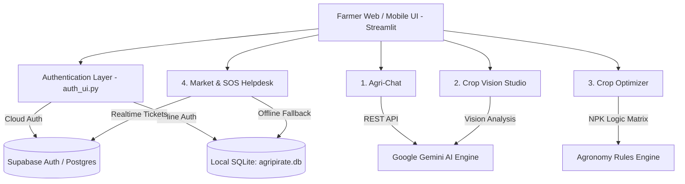

# 🌾 STARK-X | AgriPirate 🚜
### Autonomous Precision Agronomy & FinTech Intelligence Platform
**Developed for the 3-ERODE Hackathon**

[](https://www.python.org/)
[](https://streamlit.io/)
[](https://ai.google.dev/)
[](https://supabase.com/)
[](https://opensource.org/licenses/MIT)

---

## 📌 Executive Summary

Smallholder farmers in the **Kongu Nadu / Erode** belt face compounding challenges:
1. **Soil Degradation & Imbalance:** Uncalibrated N-P-K fertilizer usage depleting soil microbiomes.
2. **Pest & Disease Outbreaks:** Inability to identify fungal leaf spots, blights, and rhizome rot early.
3. **Mandi Price Exploitation:** Opacity in market arrivals leading to panic selling to middlemen at below-market rates.
4. **Delayed Disaster Response:** Fragmented communication when borewells dry up or crop epidemics hit a village.

**STARK-X (AgriPirate)** is an integrated, mobile-first agricultural operating system engineered to empower farmers with enterprise-grade computer vision diagnostics, trilingual agronomy advisory (Tamil, Tanglish, English), scientific crop-soil optimization, live FinTech market intelligence, and a cloud-synced emergency SOS helpdesk.

---

## 🚀 Core Features

### 1. 💬 WhatsApp-Themed Agri-Chat
* **Trilingual Agronomist:** Fluent in Tamil (தமிழ்), Tanglish, and English.
* **Kongu Agricultural Grounding:** Deep context on Erode staples (Turmeric, Sugarcane, Tapioca, Banana, Cotton, Millets).
* **Token-by-Token Streaming:** Real-time conversational interface with proactive weather and pest alerts.

### 2. 📸 Crop Vision Studio
* **Multimodal Leaf Pathology:** Powered by Google Gemini Vision.
* **Instant Triage:** Upload or capture leaf photos to assess infection severity (Mild, Moderate, Severe).
* **Actionable Treatment Plans:** Step-by-step chemical and organic remedies (e.g., *Pseudomonas fluorescens*, Neem oil, Mancozeb).
* **In-Memory Caching & Offline Failsafe:** Zero UI lag with automatic fallback to pre-computed agronomy reports if network or API limits are reached.

### 3. 🌾 Precision Crop Optimizer
* **Tab 1 — Recommendation Engine:** Algorithmic matching based on Nitrogen, Phosphorus, Potassium (NPK), Soil pH, Soil Type, and Water Availability.
* **Tab 2 — Compatibility Checker:** Detects critical agronomic mismatches (e.g., Clay Soil + High Salinity + Turmeric) and recommends resilient alternatives (e.g., Finger Millet / Ragi).

### 4. 📈 FinTech Mandi Market & Emergency SOS
* **Live Price Board:** Daily mandi prices, 7-day trends, and arrival volumes across Erode, Perundurai, Sathyamangalam, and Gobichettipalayam.
* **Algorithmic Financial Strategy:** Data-backed recommendations on whether to sell immediately or cure and store produce based on moisture levels.
* **Community SOS Helpdesk:** Village emergency reporting for water scarcity, borewell failure, crop epidemics, and fraud.

### 5. 🔐 Cloud Authentication & Resilience
* **Dual Persistence Layer:** Backed by **Supabase Cloud PostgreSQL** for global synchronization, with an automatic **SQLite local fallback** (`agripirate.db`) ensuring the application remains 100% operational in low-connectivity fields.
* **1-Click Demo Mode:** Instant login preset for hackathon evaluation and jury demonstrations.

---

## 🏗️ Architecture & Technology Stack



| Layer | Technologies |
|---|---|
| **Frontend UI** | Streamlit 1.65+, Custom Responsive CSS (Glassmorphism & Mobile WhatsApp theme) |
| **Generative AI** | Google Gemini 2.5 Flash / Flash Latest Vision API |
| **Cloud Database & Auth** | Supabase Cloud (PostgreSQL, PostgREST, Row Level Security) |
| **Local Cache & Offline DB** | SQLite3, In-Memory Streamlit Resource Caching |
| **Data Processing** | Pandas, Pillow (PIL), Python-Dotenv |

---

## 🛠️ Installation & Local Setup

### 1. Clone the Repository
```bash
git clone https://github.com/RAYAPURAMVIKRAM/-3-ERODE-HAckathon.git
cd -3-ERODE-HAckathon
```

### 2. Create and Activate Virtual Environment
```bash
# Windows
python -m venv venv
.\venv\Scripts\activate

# Linux / macOS
python3 -m venv venv
source venv/bin/activate
```

### 3. Install Dependencies
```bash
pip install -r requirements.txt
```

### 4. Configure Environment Variables
Copy `.env.example` to `.env`:
```bash
copy .env.example .env
```
Fill in your credentials:
```ini
GEMINI_API_KEY=your_gemini_api_key_here
SUPABASE_URL=https://aecywrmehkywbctglsyo.supabase.co
SUPABASE_KEY=your_supabase_publishable_anon_key
SUPABASE_PUBLISHABLE_KEY=your_supabase_publishable_anon_key
```

### 5. Run the Application
```bash
streamlit run app.py
```
Open your browser at `http://localhost:8501`.

---

## 🗄️ Supabase Cloud Database Configuration

To enable cloud ticket synchronization in your Supabase project:
1. Log in to your [Supabase Dashboard](https://supabase.com/dashboard/project/aecywrmehkywbctglsyo).
2. Open the **SQL Editor** tab from the left sidebar.
3. Open the file [`supabase_setup.sql`](supabase_setup.sql) included in this repository.
4. Paste the SQL statements into the editor and click **RUN**.
5. Verify the connection by running:
   ```bash
   python test_supabase.py
   ```

---

## ☁️ Deployment Guide

### Option 1: Streamlit Community Cloud (Recommended)
Because STARK-X is a reactive, multi-page WebSocket application, Streamlit Community Cloud provides native 100% free hosting:
1. Push your code to GitHub:
   ```bash
   git push origin main
   ```
2. Navigate to [share.streamlit.io](https://share.streamlit.io/).
3. Connect your GitHub account and select repository: `RAYAPURAMVIKRAM/-3-ERODE-HAckathon`.
4. Set Main file path: `app.py`.
5. Under **Advanced Settings > Secrets**, paste your `.env` variables:
   ```toml
   GEMINI_API_KEY = "your_key"
   SUPABASE_URL = "https://aecywrmehkywbctglsyo.supabase.co"
   SUPABASE_KEY = "your_key"
   ```
6. Click **Deploy!**

### Option 2: Render / Railway / Docker
For persistent server deployment, deploy as a Web Service:
* **Build Command:** `pip install -r requirements.txt`
* **Start Command:** `streamlit run app.py --server.port $PORT --server.address 0.0.0.0 --server.headless true`

---

## 👥 Team STARK-X

* **Project:** STARK-X (AgriPirate)
* **Hackathon:** 3-ERODE Hackathon
* **GitHub Repository:** [RAYAPURAMVIKRAM/-3-ERODE-HAckathon](https://github.com/RAYAPURAMVIKRAM/-3-ERODE-HAckathon.git)

---
*Built with ❤️ for the farming community of Erode, Tamil Nadu.*
